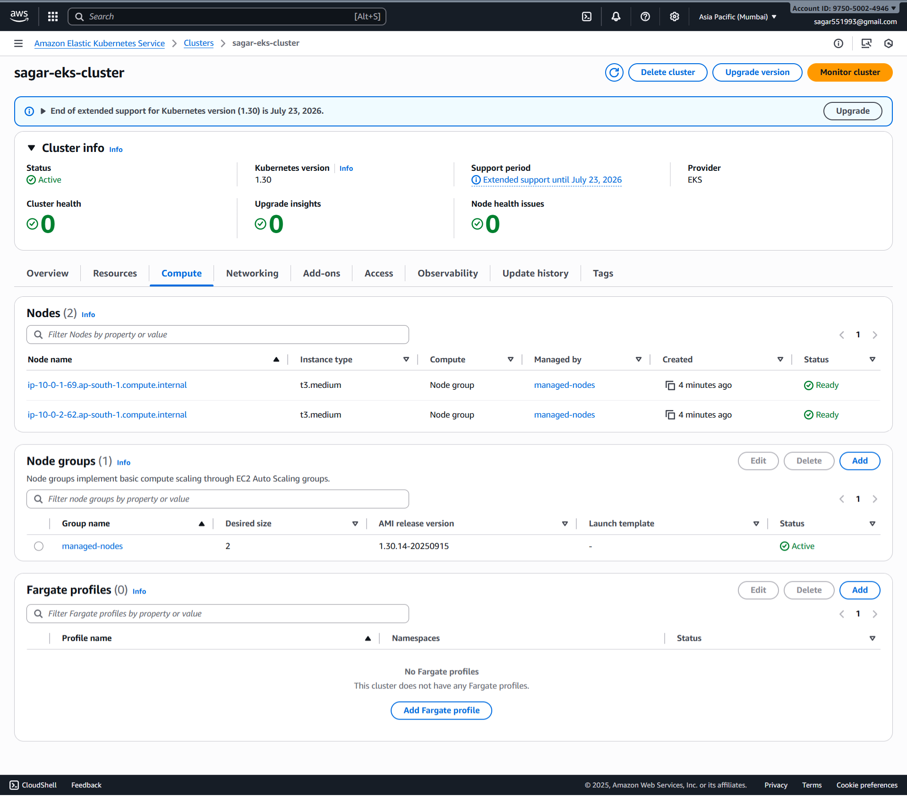

# 🚀 Python Flask App Deployment to AWS EKS using Jenkins CI/CD
[]() []() []() []() []() []()

## 📌 Project Description
This project demonstrates a **CI/CD pipeline** to deploy a **Python Flask application** into **AWS EKS** using **Terraform, Docker, Kubernetes, and Jenkins**.

The pipeline provisions infra, containerizes the Flask app, pushes to **ECR**, and deploys to **EKS** with health checks.

### 📂 Project Structure
```
coding-assignment-prt
├── Dockerfile
├── Jenkinsfile
├── README.md
├── app.py
├── deploy
│   └── deploy.sh
├── images/
├── k8s
│   ├── deployment.yaml
│   └── service.yaml
├── requirements.txt
├── terraform
│   ├── ecr.tf
│   ├── eks.tf
│   ├── outputs.tf
│   ├── providers.tf
│   ├── variables.tf
│   └── vpc.tf
└── test_app.py
```
---
## 🛠️ Technologies Used
- ☁️ **AWS** → EKS, ECR, S3, IAM, VPC  
-  **Terraform** → Infrastructure provisioning  
- 🐳 **Docker** → Flask app containerization  
- ☸️ **Kubernetes (kubectl)** → App deployment & service exposure  
- ⚙️ **Jenkins** → CI/CD automation  
- 💻 **GitHub** → Source code repository 

---

### 📦 Jenkins  Prerequisite Plugin Installation

Before proceeding with the pipeline setup or deployment process, ensure the following plugins are installed in your CI/CD environment (e.g., Jenkins).

#### ✅ Required Plugins

| Plugin Name        | Purpose |
|--------------------|---------|
| **Pipeline: AWS Steps**      | Allows you to use aws credentials to connect to deploy project. |

## ⚙️ Jenkins Credentials Setup
1️⃣ **AWS Credentials**  
- **ID**: `aws-credentials`  
- **Type**: AWS Credentials  
- **Access Key ID** / **Secret Access Key**  

3️⃣ **GitHub Credentials**  
- **ID**: `Github`  
- **Type**: Username with Password  
- **Username**: `psagar-dev`  
- **Password / Token**: GitHub PAT  

---
#### 🐳 Steps to Deploy an Application on Docker

📁 Create a `Dockerfile` inside the `coding-assignment-prt` directory:
```Dockerfile
FROM python:3.13-slim AS builder

WORKDIR /app

COPY requirements.txt .

RUN pip install --upgrade pip && \
    pip install --prefix=/install -r requirements.txt

COPY . .

FROM python:3.13-alpine

RUN apk add --no-cache libgcc libstdc++ musl

WORKDIR /app

COPY --from=builder /install /usr/local
COPY --from=builder /app /app

EXPOSE 5000

CMD ["gunicorn", "--bind", "0.0.0.0:5000", "app:app"]
```

### 🔍 Local Testing & Validation

Build the Docker image:
```bash
docker image build --no-cache -t securelooper/sagar-flask-app:latest .
```


Run the container:
```bash
docker container run -d -p 5000:5000 --name sagar-flask-app flask-app:latest
```


---
## 🛠 Terraform Infrastructure Provisioning
Terraform is used to provision AWS infrastructure for the application, including VPC, ECR, and EKS.

### Project Directory Structure
```plaintext
coding-assignment-prt/
├── terraform/
│   ├── ecr.tf
│   ├── eks.tf
│   ├── outputs.tf
│   ├── vpc.tf
│   ├── backend.tf
│   ├── providers.tf
│   ├── user-data.sh
```
### Define AWS Provider
File: `terraform/providers.tf`
```
terraform {
  required_version = ">= 1.0"

  required_providers {
    aws = {
      source  = "hashicorp/aws"
      version = "~> 5.0"
    }
  }
}

provider "aws" {
  region = var.aws_region
}
```

### Define Variables
File: `terraform/variables.tf`
```
variable "aws_region" {
  description = "AWS region to deploy resources"
  type        = string
  default     = "ap-south-1"
}

variable "cluster_name" {
  description = "Name of the EKS cluster"
  type        = string
  default     = "sagar-eks-cluster"
}

variable "vpc_cidr" {
  description = "CIDR block for the VPC"
  type        = string
  default     = "10.0.0.0/16"
}

variable "public_subnet_cidrs" {
  description = "CIDR blocks for public subnets"
  type        = list(string)
  default     = ["10.0.1.0/24", "10.0.2.0/24", "10.0.3.0/24"]
}

variable "private_subnet_cidrs" {
  description = "CIDR blocks for private subnets"
  type        = list(string)
  default     = ["10.0.4.0/24", "10.0.5.0/24", "10.0.6.0/24"]
}

variable "azs" {
  description = "Availability Zones"
  type        = list(string)
  default     = ["ap-south-1a", "ap-south-1b"]
}

variable "ecr_repo_names" {
  description = "List of ECR repository names to create"
  type        = list(string)
  default     = ["sagar-app-repo"]
}
```

###  VPC
File: `terraform/vpc.tf`
```
# Create VPC
resource "aws_vpc" "main" {
  cidr_block           = var.vpc_cidr
  enable_dns_support   = true
  enable_dns_hostnames = true

  tags = {
    Name = "${var.cluster_name}-vpc"
  }
}

resource "aws_subnet" "public" {
  count                   = length(var.public_subnet_cidrs)
  vpc_id                  = aws_vpc.main.id
  cidr_block              = var.public_subnet_cidrs[count.index]
  availability_zone       = element(["ap-south-1a", "ap-south-1b"], count.index)  # Use the corrected AZs
  map_public_ip_on_launch = true
  tags = {
    Name = "public-subnet-${element(["a", "b"], count.index)}"
  }
}

# Create Internet Gateway
resource "aws_internet_gateway" "igw" {
  vpc_id = aws_vpc.main.id

  tags = {
    Name = "${var.cluster_name}-igw"
  }
}

# Create Public Route Table
resource "aws_route_table" "public" {
  vpc_id = aws_vpc.main.id

  route {
    cidr_block = "0.0.0.0/0"
    gateway_id = aws_internet_gateway.igw.id
  }

  tags = {
    Name = "public-rt"
  }
}

# Associate Public Subnets with Public Route Table
resource "aws_route_table_association" "public" {
  count          = length(aws_subnet.public)
  subnet_id      = aws_subnet.public[count.index].id
  route_table_id = aws_route_table.public.id
}
```


###  ECR
File: `terraform/ecr.tf`
```
# Create ECR Repositories
resource "aws_ecr_repository" "repo" {
  for_each             = toset(var.ecr_repo_names)
  name                 = each.key
  image_tag_mutability = "MUTABLE" # Use "IMMUTABLE" for production

  image_scanning_configuration {
    scan_on_push = true # Enable automatic vulnerability scanning on push :cite[4]:cite[6]
  }

  encryption_configuration {
    encryption_type = "AES256" # Server-side encryption
  }

  tags = {
    Terraform   = "true"
    Environment = "dev"
  }
}

# Optional: Lifecycle Policy to clean up old images
resource "aws_ecr_lifecycle_policy" "repo_policy" {
  for_each   = toset(var.ecr_repo_names)
  repository = aws_ecr_repository.repo[each.key].name

  policy = jsonencode({
    rules = [{
      rulePriority = 1
      description  = "Keep last 30 images"
      selection = {
        tagStatus   = "any"
        countType   = "imageCountMoreThan"
        countNumber = 30
      }
      action = {
        type = "expire"
      }
    }]
  })
}
```


###  EKS
File: `terraform/eks.tf`
```
# IAM Role for EKS Cluster
resource "aws_iam_role" "eks_cluster_role" {
  name = "${var.cluster_name}-cluster-role"

  assume_role_policy = jsonencode({
    Version = "2012-10-17"
    Statement = [
      {
        Effect = "Allow"
        Principal = {
          Service = "eks.amazonaws.com"
        }
        Action = "sts:AssumeRole"
      }
    ]
  })
}

# Attach AmazonEKSClusterPolicy to Cluster Role
resource "aws_iam_role_policy_attachment" "eks_cluster_policy" {
  policy_arn = "arn:aws:iam::aws:policy/AmazonEKSClusterPolicy"
  role       = aws_iam_role.eks_cluster_role.name
}

# Create EKS Cluster
resource "aws_eks_cluster" "cluster" {
  name     = var.cluster_name
  role_arn = aws_iam_role.eks_cluster_role.arn
  version  = "1.30" # Specify your desired Kubernetes version

  vpc_config {
    subnet_ids = aws_subnet.public[*].id # Place control plane in private subnets
    # endpoint_private_access = true # Uncomment for private cluster
    # endpoint_public_access  = false # Uncomment for private cluster
  }

  depends_on = [aws_iam_role_policy_attachment.eks_cluster_policy]
}

# IAM Role for EKS Node Group
resource "aws_iam_role" "eks_node_role" {
  name = "${var.cluster_name}-node-role"

  assume_role_policy = jsonencode({
    Version = "2012-10-17"
    Statement = [
      {
        Effect = "Allow"
        Principal = {
          Service = "ec2.amazonaws.com"
        }
        Action = "sts:AssumeRole"
      }
    ]
  })
}

# Attach necessary policies to Node Role
resource "aws_iam_role_policy_attachment" "eks_worker_node_policy" {
  policy_arn = "arn:aws:iam::aws:policy/AmazonEKSWorkerNodePolicy"
  role       = aws_iam_role.eks_node_role.name
}

resource "aws_iam_role_policy_attachment" "eks_cni_policy" {
  policy_arn = "arn:aws:iam::aws:policy/AmazonEKS_CNI_Policy"
  role       = aws_iam_role.eks_node_role.name
}

resource "aws_iam_role_policy_attachment" "ecr_read_only_policy" {
  policy_arn = "arn:aws:iam::aws:policy/AmazonEC2ContainerRegistryReadOnly"
  role       = aws_iam_role.eks_node_role.name
}

# Create EKS Managed Node Group
resource "aws_eks_node_group" "nodes" {
  cluster_name    = aws_eks_cluster.cluster.name
  node_group_name = "managed-nodes"
  node_role_arn   = aws_iam_role.eks_node_role.arn
  subnet_ids      = aws_subnet.public[*].id

  scaling_config {
    desired_size = 2
    max_size     = 3
    min_size     = 1
  }

  instance_types = ["t3.medium"]

  # Ensure the IAM Role permissions are created before and deleted after the Node Group handling
  depends_on = [
    aws_iam_role_policy_attachment.eks_worker_node_policy,
    aws_iam_role_policy_attachment.eks_cni_policy,
    aws_iam_role_policy_attachment.ecr_read_only_policy,
  ]
}
```



###  EKS
File: `terraform/outputs.tf`
```
output "vpc_id" {
  description = "ID of the VPC"
  value       = aws_vpc.main.id
}

output "eks_cluster_name" {
  description = "Name of the EKS cluster"
  value       = aws_eks_cluster.cluster.name
}

output "eks_cluster_endpoint" {
  description = "Endpoint for EKS control plane"
  value       = aws_eks_cluster.cluster.endpoint
}

output "ecr_repository_urls" {
  description = "URLs of the ECR repositories"
  value       = { for k, v in aws_ecr_repository.repo : k => v.repository_url }
}

# Command to update kubeconfig for the created cluster
output "configure_kubectl" {
  description = "Configure kubectl to use the new EKS cluster"
  value       = "aws eks update-kubeconfig --region ${var.aws_region} --name ${aws_eks_cluster.cluster.name}"
}
```
## 🚀 Deployment Steps

**Configure AWS Credentials:** Ensure AWS credentials are set in ~/.aws/credentials or as environment variables.

**Initialize Terraform**
```
terraform init
```


**Format and Validate:**
```
terraform fmt
terraform validate
```


**Preview Changes:**
```
terraform plan
```


**Apply Configuration:**
```
terraform apply
```


**Destroy Infrastructure** (when needed):
You can use destroy
```
terraform destroy
```


---
### ☸️ Steps to Deploy an Application on Kubernetes

#### 📄 Create Deployment
**File:** `k8s/deployment.yaml`
```yml
apiVersion: apps/v1
kind: Deployment
metadata:
  name: flask-deployment
  namespace: default
  labels:
    app: flask
spec:
  replicas: 2
  selector:
    matchLabels:
      app: flask
  template:
    metadata:
      labels:
        app: flask
    spec:
      containers:
      - name: flask-app
        image: <IMAGE_NAME>
        ports:
        - containerPort: 5000
        resources:
          requests:
            memory: "128Mi"
            cpu: "250m"
          limits:
            memory: "256Mi"
            cpu: "500m"
        livenessProbe:
          httpGet:
            path: /
            port: 5000
          initialDelaySeconds: 10
          periodSeconds: 10
        readinessProbe:
          httpGet:
            path: /
            port: 5000
          initialDelaySeconds: 5
          periodSeconds: 5
```
📌 **Apply Deployment**
```bash
kubectl apply -f k8s/deployment.yaml
```
🔍 **Verify Pods**
```bash
kubectl get pods
```

#### 📄 Create Service
**File:** `k8s/service.yaml`
```yml
apiVersion: v1
kind: Service
metadata:
  name: flask-service
  namespace: default
spec:
  type: LoadBalancer
  ports:
  - port: 80
    targetPort: 5000
    protocol: TCP
  selector:
    app: flask
```

📌 **Apply Service**
```bash
kubectl apply -f k8s/service.yaml
```
🔍 **Verify Service**
```bash
kubectl get svc
```
---
### 🚀 Jenkins Pipeline Configuration for `Coding assignment Prt`
1. **Log in to Jenkins**
2. **Click on “New Item”**
   - This is usually located on the left-hand side of the Jenkins dashboard
3. **Enter a name for your job**
   - Example: `Coding assignment Prt`
4. **Select “Pipeline” as the project type**
5. **Click “OK”**
   - This will take you to the configuration page for the new pipeline job

#### 📁 Pipeline Definition

- **Definition**: Pipeline script from SCM
- **SCM**: Git
- **Repository URL**: `https://github.com/psagar-dev/coding-assignment-prt.git`
- **Credentials**: `psagar-dev/******`
- **Branch Specifier**: `main`
- **Script Path**: `Jenkinsfile`

#### ⚡ Trigger

- [x] GitHub hook trigger for GITScm polling 

#### 📝 Notes

- This configuration uses a declarative pipeline stored in the `main` branch under the file `Jenkinsfile`.
- Ensure that the **GitHub webhook** is properly configured in your GitHub repository settings to trigger Jenkins jobs automatically.


---

### 📄 Jenkinsfile

```groovy
pipeline {
    agent any

    environment {
        AWS_REGION = 'ap-south-1'
        ECR_REPO = '975050024946.dkr.ecr.ap-south-1.amazonaws.com/sagar-app-repo'
        IMAGE_TAG = "${BUILD_NUMBER}"
        EKS_CLUSTER_NAME = 'sagar-eks-cluster'
        DOCKER_IMAGE = "${ECR_REPO}:${IMAGE_TAG}"
    }

    stages {
        stage('Checkout') {
            steps {
                checkout scm
                echo 'Code checked out from Git'
            }
        }

        stage('Build') {
            steps {
                sh 'docker build --no-cache -t flask-app-repo .'
            }
        }

        stage('Push to ECR') {
            steps {
                withAWS(region: "${AWS_REGION}", credentials: 'aws-credentials') {
                    sh """
                    # Authenticate Docker with ECR
                    aws ecr get-login-password --region ${AWS_REGION} | docker login --username AWS --password-stdin ${ECR_REPO}

                    # Tag the local image with the full ECR repo path
                    docker tag flask-app-repo:latest ${DOCKER_IMAGE}

                    # Push the tagged image to ECR
                    docker push ${DOCKER_IMAGE}
                    """
                    echo '✅ Docker image pushed to ECR'
                }
            }
        }


        stage('Deploy to EKS') {
            steps {
                withAWS(region: "${AWS_REGION}", credentials: 'aws-credentials') {
                    sh """
                    aws eks update-kubeconfig --name ${EKS_CLUSTER_NAME} --region ${AWS_REGION}
                    sed "s|<IMAGE_NAME>|${DOCKER_IMAGE}|g" k8s/deployment.yaml > k8s/deployment-rendered.yaml

                    # Apply manifests
                    kubectl apply -f k8s/deployment-rendered.yaml
                    kubectl apply -f k8s/service.yaml
                    """
                    echo 'Deployed to EKS'
                }
            }
        }
    }

    post {
        success {
            echo 'Pipeline completed successfully'
        }
        failure {
            echo 'Pipeline failed'
        }
        always {
            sh 'docker system prune -f'
            echo 'Cleaned up Docker resources'
        }
    }
}
```

### 🚀 Pipeline Overview


##### EKS deployment

##### EKS pod


##### EKS service


##### EKS Load Balancer


### **🌍 Production App Live:**


---
## 📜 Project Information

### 📄 License Details
This project is released under the MIT License, granting you the freedom to:
- 🔓 Use in commercial projects
- 🔄 Modify and redistribute
- 📚 Use as educational material

## 📞 Contact

📧 Email: [Email Me](securelooper@gmail.com
)
🔗 LinkedIn: [LinkedIn Profile](https://www.linkedin.com/in/sagar-93-patel)  
🐙 GitHub: [GitHub Profile](https://github.com/psagar-dev)  

---

<div align="center">
  <p>Built with ❤️ by Sagar Patel</p>
</div>